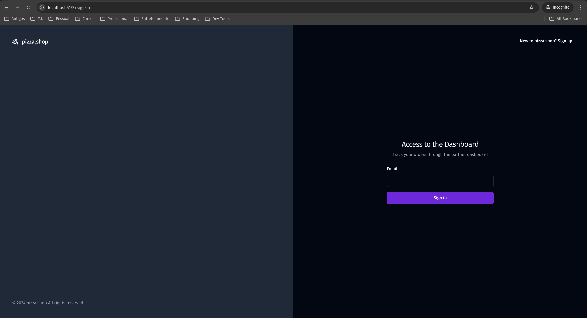
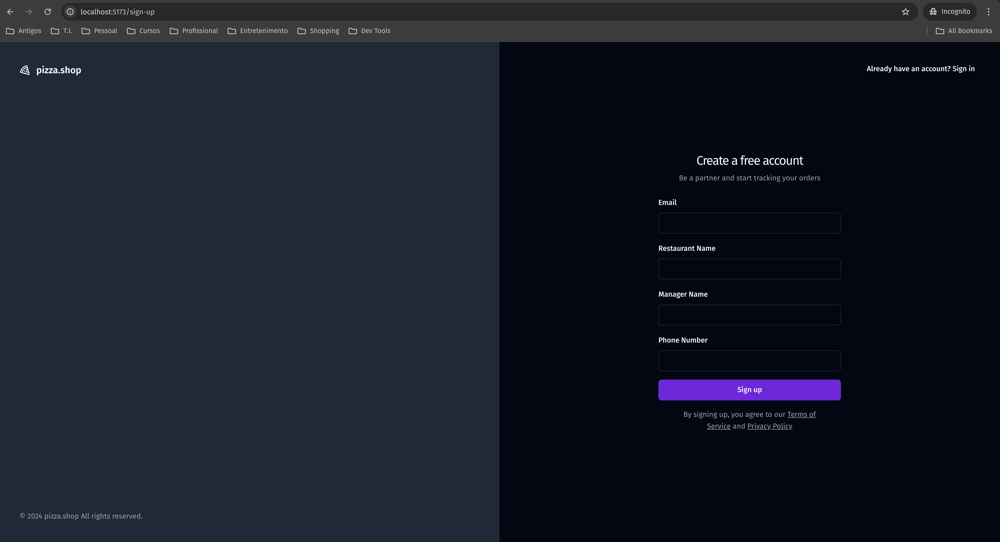
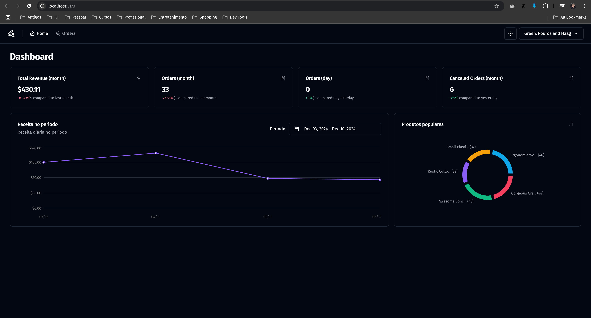
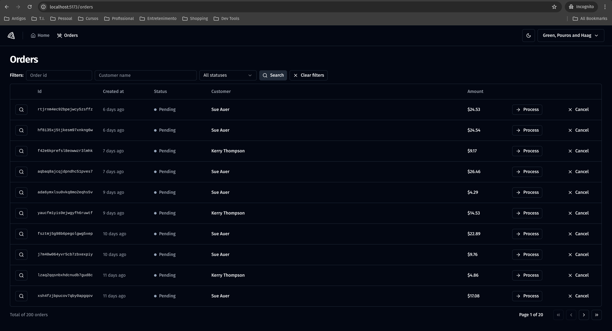

# Front-End Dashboard Project

## Screenshots

|  |  |
| ---------------------------------------------- | ---------------------------------------------- |
|  |  |


This project is a study initiative to practice software engineering concepts focused on front-end development using React and modern tools from the JavaScript ecosystem. It aims to develop an interactive dashboard with diverse features, promoting the understanding of best practices and related technologies.

## Objective

Explore and practice essential concepts in front-end projects, such as:

- State and data management.
- Integration with APIs and request handling.
- Creating responsive and accessible interfaces.
- Using tests to ensure code quality.

## Technologies Used

- **React**: Main library for building the user interface.
- **TypeScript**: To enhance code safety and readability.
- **Tailwind CSS**: For quick and responsive styling.
- **Vite**: Build tool for modern front-end applications.
- **Mock Service Worker (MSW)**: To mock API calls during development and testing.
- **Vitest**: For unit and integration tests.

## Main Features

1. **Metrics Dashboard**
   - Visualization of daily and monthly metrics.
   - Order management with real-time status updates.

2. **User Management**
   - Secure authentication.
   - Profile updates.

3. **Customizable Interface**
   - Support for light and dark themes.
   - Modular componentization for code reuse.

## Project Structure

- **src/components**: Reusable UI components.
- **src/pages**: Main application pages.
- **src/api**: Functions for API communication.
- **src/mocks**: Mock implementation for tests.
- **src/styles**: Base styling files and Tailwind CSS configurations.

## Local Setup

### Requirements

- Node.js >= 18.x
- pnpm (or npm/yarn)

### Installation

1. Clone the repository:
   ```bash
   git@github.com:ivanseibel/mba-rocketseat-pizzashop-web.git
   cd mba-rocketseat-pizzashop-web
   ```

2. Install dependencies:
   ```bash
   pnpm install
   ```

3. Configure environment variables:
   - Copy the `.env.local.example` file to `.env.local` and adjust the values as needed.

4. Start the development server:
   ```bash
   pnpm dev
   ```

5. Access the application at `http://localhost:5173`.

## Tests

To run the tests:

```bash
pnpm test
```

The tests cover components, integrations, and main features.

## License

This project is licensed under the terms of the MIT license. See the `LICENSE` file for more details.

---

### Notes

This project uses a mock API to simulate functionalities. Ensure to follow the instructions to properly configure the mocks to avoid errors during development and testing.

